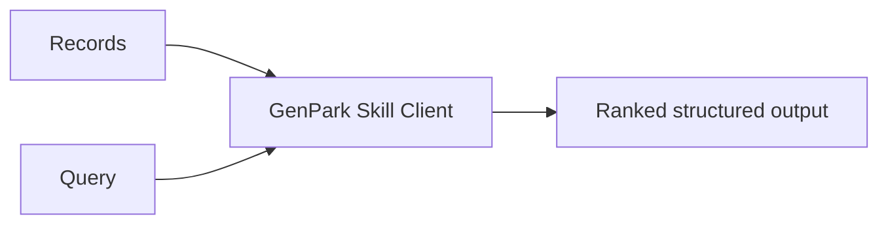

# genpark-evidence-backed-product-comparison-skill

   

Compare candidate products using constraints, evidence records, and transparent scoring.

## Quick Start

```bash
python example_usage.py
```



MIT licensed. Python 3.9+ standard library only.
